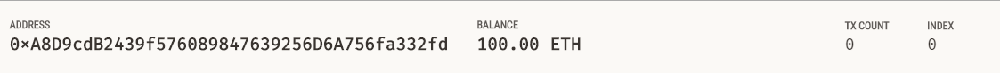
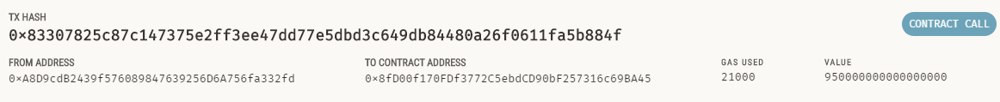

# Blockchain Wallets
UNCC Online FinTech Bootcamp Module 19 Challenge due by 11:59pm 4/17/2022

Image from [bootcampspot.com](https://courses.bootcampspot.com/courses/980/files/1033423/download)

---

## Background

We work at a startup that is building a new and disruptive platform called Fintech Finder. Fintech Finder is an application that its customers can use to find fintech professionals from among a list of candidates, hire them, and pay them. As Fintech Finder’s lead developers, we have been tasked with integrating the Ethereum blockchain network into the application in order to enable our customers to instantly pay the fintech professionals whom they hire with cryptocurrency.

---

## What's Being Created

To complete this Challenge, we will use two Python files, both of which are contained in the starter folder.

 - The first file that we will use is called fintech_finder.py. It contains the code associated with the web interface of our application. The code included in this file is compatible with the Streamlit library. We will write all of our code for this Challenge in this file.

 - The second file that we will use is called crypto_wallet.py. This file contains the Ethereum transaction functions that we have created throughout this module’s lessons. By using import statements, we will integrate the crypto_wallet.py Python script into the Fintech Finder interface program that is found in the fintech_finder.py file.

Integrating these two files will allow us to automate the tasks associated with generating a digital wallet, accessing Ethereum account balances, and signing and sending transactions via a personal Ethereum blockchain called Ganache.

Specifically, we will assume the perspective of a Fintech Finder customer in order to do the following:

 1. Generate a new Ethereum account instance by using the mnemonic seed phrase provided by Ganache.

 2. Fetch and display the account balance associated with our Ethereum account address.

 3. Calculate the total value of an Ethereum transaction, including the gas estimate, that pays a Fintech Finder candidate for their work.

 4. Digitally sign a transaction that pays a Fintech Finder candidate, and send this transaction to the Ganache blockchain.

 5. Review the transaction hash code associated with the validated blockchain transaction.

---

## Technologies

This application is written in Python 3.7 using Jupyter Lab v3.0.14

 - [Streamlit](https://streamlit.io/) - *an open source library that turns data scripts into shareable web apps in minutes.*
 - [Web3.py v5.17](https://web3py.readthedocs.io/en/stable/) - *a Python library for interacting with Ethereum.*
 - [Ganache](https://trufflesuite.com/ganache/) - *a program that allows you to quickly set up a local blockchain, which you can use to test and develop smart contracts.*
 - [mnemonic](https://pypi.org/project/mnemonic/) - *implementation of BIP-0039: Mnemonic code for generating deterministic keys*
 - [bip44](https://pypi.org/project/bip44/) - *simple Python bip44 implementation. Mnemonic + bip32.*
 - [python-dotenv](https://pypi.org/project/python-dotenv/) - *a Python library that reads key-value pairs from a .env file and can set them as environment variables.*
 - [Requests](https://docs.python-requests.org/en/latest/) - *an elegant and simple HTTP library for Python, built for human beings.*

### Installation Guide

prior to running these libraries, install them from the command line:
 
  - streamlit: `pip install streamlit`
  - web3: `pip install web3`
  - eth-tester: `pip install eth-tester==0.5.0b3`
  - mnemonic: `pip install mnemonic`
  - bip44: `pip install bip44`
  - python-dotenv: `pip install python-dotenv`
  - Requests: `python -m pip install requests`
  
---

## Usage

### Ganache wallet balance before transaction:

### Ganache balance after transaction:

### Ganache transaction detail:

### Streamlit video of Fintech_Finder:

---

## Contributors
Geoff Tarleton - jobeycat@protonmail.com

adapted from Starter Code supplied by UNCC FinTech Online Bootcamp by Trilogy Educational Services, a 2U, Inc. brand.

---

## License

[MIT](LICENSE)